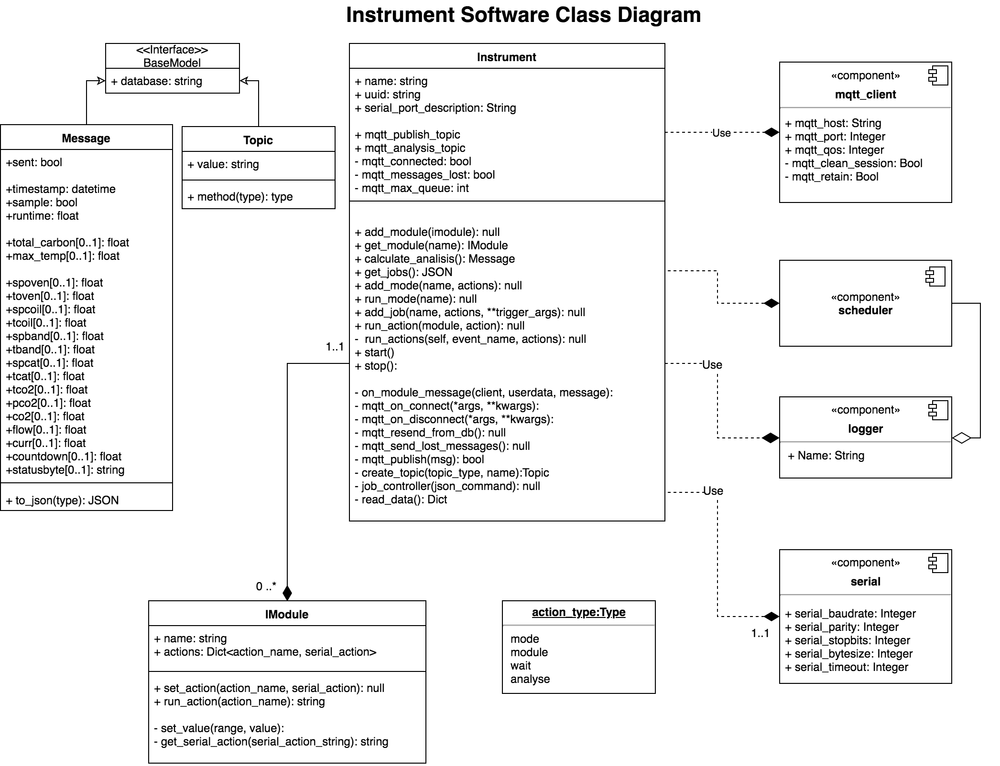

# Carbon Measurement System
## Python Application
*Application developed in **Python** to work in conjunction with any **MQTT broker** and any **serial** controlled device.*

The installation is for use with Node.js Control & Visualization Application and IBM Cloud Services.

### **Installation**
1. Clone repository:
```bash
$ git clone https://github.com/javicuriel/GAW-Instrument
```
2. Travel to cloned folder:
```bash
$ cd GAW-Instrument
```
3. Open config.ini and check **[configuration file](#configuration-file)**.
4. Run installation script as sudo with serial device connected:
```bash
$ sudo python installer.py
```
5. Follow instructions (Automatic Setup):
```
Welcome to FATCAT-Py Installer
It appears this is the first time the application is run.
Would you like to do a Automatic Setup?
1) Yes
2) No (Manual UUID & TOKEN set)
```
6. Enter device descriptors and hit enter (**latitude & longitude must be numbers**):
```
Enter location:
Enter latitude:
Enter longitude:
```
7. Enter username and password for **API_URL** set in configuration file.
```
Enter username for 'API_URL':
Enter password for 'API_URL':
```

*If installation is successful, the application will start immediately and will start sending and saving messages to `local_store.db` while logging to `instrument.log`*


### **Configuration-file**
1. Set API url
```ini
[GENERAL_SETTINGS]
API_URL: "https://carbonmeasurementsystem.eu-de.mybluemix.net/"
```
2. Set MQTT settings like the following example:
```ini
[MQTT_SETTINGS]
MQTT_ORG: 'kbld7d'
MQTT_SERVER: 'messaging.internetofthings.ibmcloud.com'
MQTT_PORT: 8883
MQTT_QOS: 1
MQTT_KEEPALIVE: 5
```
3. Set serial settings like the following example (Application will look for serial with **SERIAL_PORT_DESCRIPTION**):
```ini
[SERIAL_SETTINGS]
SERIAL_PORT_DESCRIPTION: 'NANOTDMRA'
SERIAL_BAUDRATE: 115200
SERIAL_PARITY: serial.PARITY_NONE
SERIAL_STOPBITS: serial.STOPBITS_ONE
SERIAL_BYTESIZE: serial.EIGHTBITS
SERIAL_TIMEOUT: 1
```
4. Set modules and their respective actions with the following format:
```ini
module_name:'action:serial_action',...'action_2:serial_action(range)'
```
*ej.*
```ini
[MODULES]
pump:'on:U1000','off:U0000','flow:F0000-F0020'
band:'on:B1000','off:B0000','temperature:S2000-S2100', 'p_parameters:P2000-P2100'
oven:'on:O1000','off:O0000','burn_cycle_time:A0000-A0080','temperature:S1000-S1100'
valve:'on:V1000','off:V0000'
licor:'on:L1000','off:L0000'
extp:'on:E1000','off:E0000'
```
5. Set modes and their respective actions with the following format:
```ini
mode_name:'action_type_1:module_name_1:action_1', ...
```
*ej.*
```ini
[MODES]
analysis:'module:licor:on','module:extp:off','module:valve:on','module:pump:on'
sampling:'module:pump:off','module:valve:off', 'module:extp:on','module:licor:off'
```

<!-- For PDF better formatting -->
<!-- <br/><br/><br/><br/><br/><br/><br/><br/><br/><br/><br/> -->

## Library Description
The application has one main class called **Instrument** which has as attributes multiple classes with the following structure:

* Instrument
  * MQTT Client
  * Serial
  * Scheduler
  * Logger
  * IModule *(Can have multiple)*

<br/><br/><br/>


<br/><br/><br/>

### Configuring the Instrument
To configure the Instrument, values must me set either by using the main.py script and config.ini file or by passing parameter manually.

*ej.*
```python
instrument = Instrument(
      mqtt_org = 'kbld7d'
      mqtt_host = 'messaging.internetofthings.ibmcloud.com'
      mqtt_port = 8883
      mqtt_keep_alive = 1
      mqtt_qos = 5
      serial_port_description = 'NANOTDMRA'
      serial_baudrate = 115200
      serial_parity = serial.PARITY_NONE
      serial_stopbits = serial.STOPBITS_ONE
      serial_bytesize = serial.EIGHTBITS
      serial_timeout = 1
  )
```
### Starting the instrument
*Before starting the instrument you must add all IModules and modes in order for proper functionality with MQTT messaging. Also, in order for the MQTT Client to connect, a username and token is needed, these are taken from the environment variables `MQTT_UUID` and `IBM_TOKEN`*

Starting the instrument will connect the MQTT client asynchronously and subscribe to the topics to control each IModule. It will then resend all messages lost and start the serial reader with a blocking action creating a new message for each line it reads from serial while saving the messages locally and sending them through `MQTT_TYPE_READING` topic. To start the instrument call `start()`.

*ej.*
```python
instrument.start()
```

### Adding IModules
IModules are the software representation of the different capabilities the serial controlled device might have. The IModule has two editable attributes, the name and a dictionary of actions. The key of the actions representing the action name and the value representing the serial action. To add a new action call the following function `set_action(action_name, serial_action)`. To add the module to the instrument call `add_module(module)`, this will create a controllable module via MQTT topic designated for each module.

 For example, the device might have a pump with capabilities of turning on, off, or controlling the flow level. Here is an example of how we might configure this setup.

*ej.*
```python
module = IModule(name = 'pump')
module.set_action('on', 'U1000')
module.set_action('off', 'U0000')
module.set_action('flow', 'F0000-F0020')
```
```python
instrument.add_module(module)
```
##### Run action programmatically
With the module added to the instrument you can now call `run_action(module, action)` to write the serial action to serial device.

*ej.*
```python
instrument.run_action('pump', 'on')
```
### Adding Modes
Modes are a set of actions run in order. To add a mode you must set an array of actions and each action with the following format: `[action_type, module, action]`

*ej.*
```python
actions = [
  ['module','pump','off'],
  ['module','valve','off']
]
instrument.add_mode('analysis', actions)
```
### Adding Jobs
Jobs are a set of actions run in order in a certain interval, cron or date. The jobs are stored in a local database so if application crashed it will have a record of missed and missing jobs and will execute accordingly. To add a job to the instrument use the following function `add_job(name, actions, trigger)`

*ej.*
```python
triggerCron = ['cron', "2 * * * *"]
triggerInterval = ['interval', 'minutes', '3']
triggerDate = ['date', '1979-10-12T00:00:00.00Z']
```

```python
actions = [
  ['module','pump','off'],
  ['wait','minutes','2'],
  ['mode','analysis', None],
]
# Use which ever trigger you prefer
instrument.add_job(name = 'example', actions = actions, trigger = triggerCron)
```
## Files
#### main.py
Main script will create a new object Instrument with MQTT and serial settings collected from config.ini. It will also create the stated IModules and modes in the configuration file and will start the Instrument.

#### installer.py
Installer script will ask for Automatic setup or Manual. If manual is chosen then you must provide MQTT Authentication variables `MQTT_UUID` and `IBM_TOKEN`. If chosen automatic, the script will look for the serial in the config.ini file and ask for serial number of the connected serial device. The serial number will then be set as `MQTT_UUID`, it will then ask for device description variables. After all wariables are set, the script will ask for username and password for the  API where it will request a creation of a new device and if successful if will respond with the newly created token which will be set in the environment as `IBM_TOKEN`. After a successful API call, the program will create a service script with the environment variables and will save to `/etc/systemd/system/` which will in turn make the service auto restart after shutdown or crash and install requirements.

<br/><br/>


#### Instrument.py
Declare Instrument class and functions.

#### models.py
Declare Message, Topic and IModules classes and functions.

#### requirements.txt
Requirements needed to run the application.

#### config.ini
Configuration setting for the application.

#### SerialEmulator.py
Emulator used for testing and development.

#### TestClass.py
Test class to test application functions.
